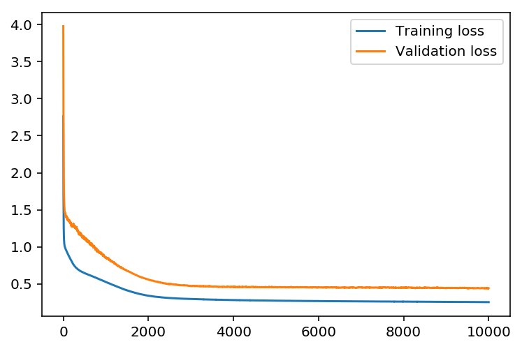
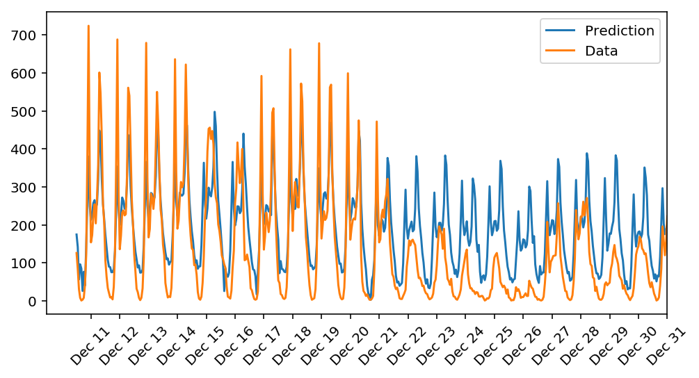

# Build Neural Network to Predict Daily Bike rental ridership.

<p align="center">

</p>

## Installation

1. Enter your new environment:
  * Mac/Linux:
  ```
  $  source activate dlnd
  ```
  * Windows:
  ```
  $ activate dlnd
  ```

2. Ensure you have numpy, matplotlib, pandas, and jupyter notebook installed by doing the following:

```
$ conda install numpy matplotlib pandas jupyter notebook
```

3. Run the following to open up the notebook:

```
$ jupyter notebook dlnd-your-first-neural-network.ipynb
```

4. You can deactivate your environment by
  * Mac/Linux:
  ```
  $  source deactivate
  ```
  * Windows:
  ```
  $ deactivate
  ```

## Data Set
This dataset has the number of riders for each hour of each day from January 1 2011 to December 31 2012. The number of riders is split between casual and registered, summed up in the cnt column. You can see the first few rows of the data above.
Below is a plot showing the number of bike riders over the first 10 days or so in the data set. (Some days don't have exactly 24 entries in the data set, so it's not exactly 10 days.) You can see the hourly rentals here. This data is pretty complicated! The weekends have lower over all ridership and there are spikes when people are biking to and from work during the week. Looking at the data above, we also have information about temperature, humidity, and windspeed, all of these likely affecting the number of riders. You'll be trying to capture all this with your model.

<p align="center">

</p>

## Model Implementations
* Implement the sigmoid function to use as the activation function. Set self.activation_function in __init__ to your sigmoid function.
* Implement the forward pass in the train method.
* Implement the backpropagation algorithm in the train method,  including calculating the output error.
* Implement the forward pass in the run method.

<p align="center">

</p>


## The Loss Function after Training the Network
Set the hyperparameters for the network. The strategy here is to choose hyperparameters ,including ### Set the
### hyperparameters I set
* iterations = 10000
* learning_rate = 0.1
* hidden_nodes = 5
* output_nodes = 1

Then , we get

<p align="center">

</p>

At the final progress of 100 %, the Training loss is 0.104 and Validation loss is 0.212.

## The Prediction

<p align="center">

</p>

It can be seen that the network works very well only between Dec 11 and Dec20.
